# System Architecture

This document describes the architecture of the Decisions system using the C4 model with Mermaid diagrams.

## System Context (C4 Level 1)

```mermaid
graph TB
    User[👤 User<br/>Decision Maker]
    
    subgraph Decisions System
        Frontend[🔬 React Frontend<br/>Tailwind CSS + Framer Motion]
        Backend[⚡ FastAPI Backend<br/>Python 3.13]
    end
    
    PostgreSQL[(🗄️ PostgreSQL<br/>Decision Storage)]
    Qdrant[(🧠 Qdrant<br/>Vector Database)]
    OpenAI[🤖 OpenAI API<br/>GPT-4o-mini]
    
    User -->|Create & analyze<br/>decisions| Frontend
    Frontend -->|REST API| Backend
    Backend -->|Store decisions| PostgreSQL
    Backend -->|RAG retrieval| Qdrant
    Backend -->|LLM analysis| OpenAI
    
    style Frontend fill:#6366f1,color:#fff
    style Backend fill:#8b5cf6,color:#fff
    style PostgreSQL fill:#3b82f6,color:#fff
    style Qdrant fill:#10b981,color:#fff
    style OpenAI fill:#f59e0b,color:#fff
```

---

## Container Diagram (C4 Level 2)

```mermaid
graph TB
    subgraph Client
        Browser[🌐 Web Browser]
        React[⚛️ React App<br/>Vite + Tailwind v4]
    end
    
    subgraph Backend Services
        API[📡 FastAPI<br/>REST API]
        Orchestrator[🎯 Orchestrator<br/>Background Tasks]
        MLScoring[🔬 ML Scoring<br/>Cross-Encoder]
        LLMService[🤖 LLM Service<br/>GPT-4o-mini]
        RAGEngine[🧠 RAG Engine<br/>BGE-M3 Embeddings]
    end
    
    subgraph Data Layer
        DB[(PostgreSQL<br/>Decisions + Users)]
        VectorDB[(Qdrant<br/>Embeddings)]
    end
    
    Browser -->|HTTPS| React
    React -->|Polling<br/>3s interval| API
    API -->|Background task| Orchestrator
    
    Orchestrator -->|1. Score args| MLScoring
    Orchestrator -->|2. Retrieve| RAGEngine
    Orchestrator -->|3. Analyze| LLMService
    Orchestrator -->|4. Index| RAGEngine
    
    API -->|CRUD| DB
    RAGEngine -->|Vector search| VectorDB
    LLMService -->|API call| OpenAI[OpenAI API]
    
    style React fill:#6366f1,color:#fff
    style API fill:#8b5cf6,color:#fff
    style Orchestrator fill:#a855f7,color:#fff
    style MLScoring fill:#ec4899,color:#fff
    style LLMService fill:#f59e0b,color:#fff
    style RAGEngine fill:#10b981,color:#fff
```

---

## Analysis Flow (Sequence Diagram)

---

## State Transition Diagram

---

## Data Model (Entity Relationship)

---

## Technology Stack

### Frontend

### Backend

### AI/ML Stack

---

## Deployment Architecture

---

## Security Architecture

**Security Layers:**
1. **Rate Limiting**: 5 requests/minute per IP for analysis
2. **Input Validation**: Pydantic schemas with custom validators
3. **User Identification**: X-User-ID header (MVP), JWT tokens (future)
4. **Structured Logging**: JSON logs for audit trail
5. **CORS**: Configured for specific origins in production

---

## Monitoring & Observability

**Current Monitoring:**
- Structured JSON logging (request/response)
- Basic health check: `/health`
- Detailed health check: `/health/detailed`
- Request duration tracking

**Future Enhancements:**
- Prometheus metrics
- Grafana dashboards
- Sentry error tracking
- APM (Application Performance Monitoring)
