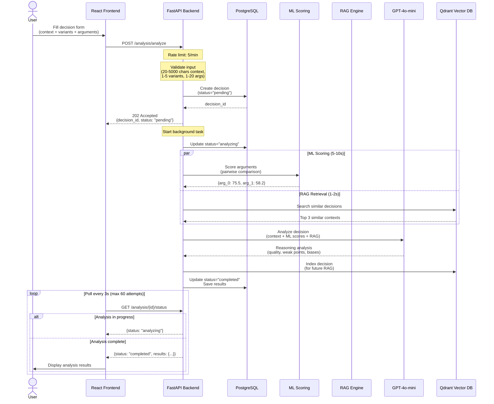
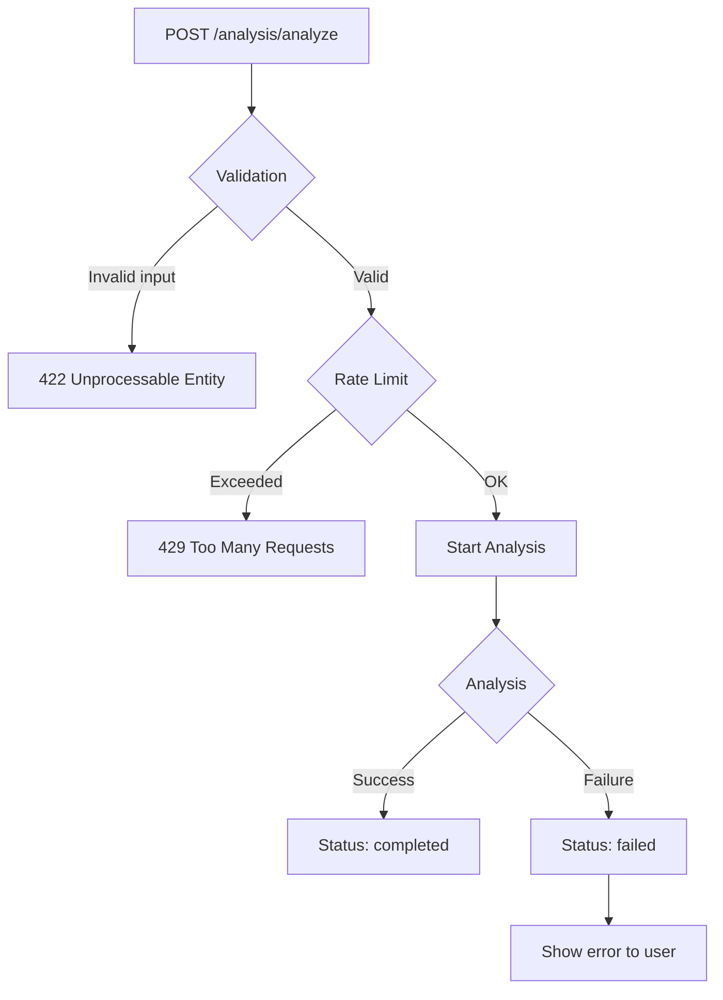
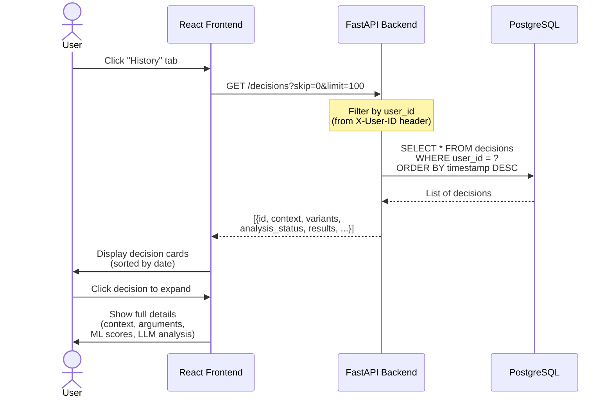
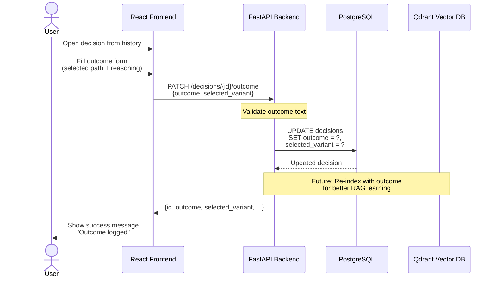
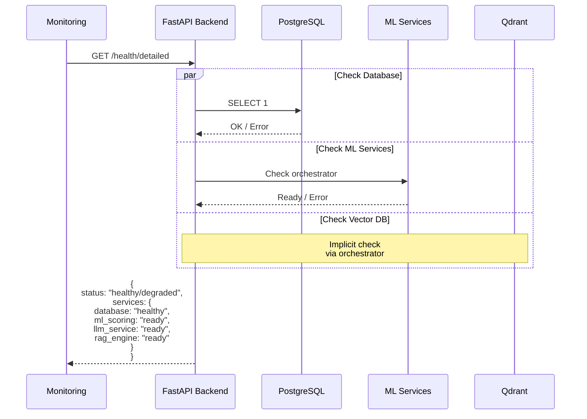
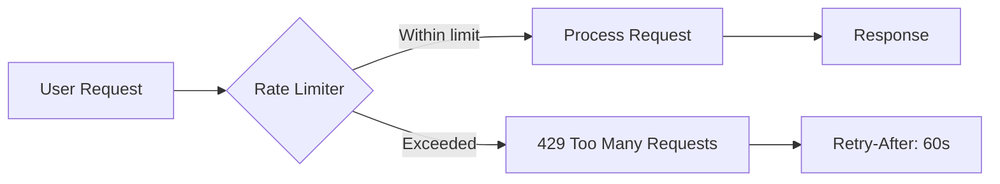
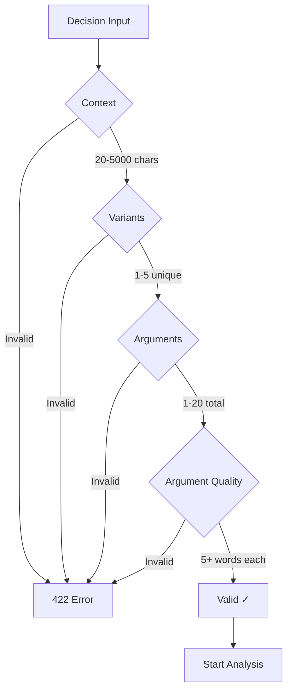

# API Use Cases

This document describes the main use cases for the Decisions API with visual sequence diagrams.

## Use Case 1: Create and Analyze Decision

**Actor:** User  
**Goal:** Get AI analysis of decision reasoning quality

### Sequence Diagram

### Success Criteria
- Decision created in DB
- Analysis completes in 15-25 seconds
- LLM provides actionable insights
- Results saved and retrievable

### Error Scenarios

---

## Use Case 2: View Decision History

**Actor:** User  
**Goal:** Review past decisions and their analyses

### Sequence Diagram

### Success Criteria
- All user's decisions returned
- Sorted by timestamp (newest first)
- Pagination works correctly
- Analysis results displayed properly

---

## Use Case 3: Record Decision Outcome

**Actor:** User  
**Goal:** Log which path was chosen and what happened

### Sequence Diagram

### Success Criteria
- Outcome saved to DB
- `selected_variant` captured for RAG learning
- Visible in history view
- Can be used for future recommendations

---

## Use Case 4: Health Check

**Actor:** Monitoring System  
**Goal:** Verify all services are operational

### Sequence Diagram

---

## Performance Characteristics

| Endpoint | Response Time | Notes |
|----------|--------------|-------|
| POST /analysis/analyze | <100ms | Returns 202 immediately |
| GET /analysis/{id}/status | <50ms | Fast DB query |
| GET /decisions | <200ms | Depends on pagination |
| PATCH /decisions/{id}/outcome | <100ms | Simple update |

**Background Analysis Breakdown:**
- ML Scoring: 5-10s (depends on # of arguments)
- RAG Retrieval: 1-2s
- LLM Analysis: 10-15s
- **Total: 15-25s**

---

## Rate Limiting

**Limits:**
- `/analysis/analyze`: 5 requests/minute per IP
- Other endpoints: No limit (for MVP)

---

## Data Validation Rules

**Validation Rules:**
- **Context**: 20-5000 characters, min 10 words
- **Variants**: 1-5 unique names, max 100 chars each
- **Arguments**: 1-20 total, min 5 words each, max 2000 chars
- **Argument-Variant Matching**: All arguments must reference valid variants
